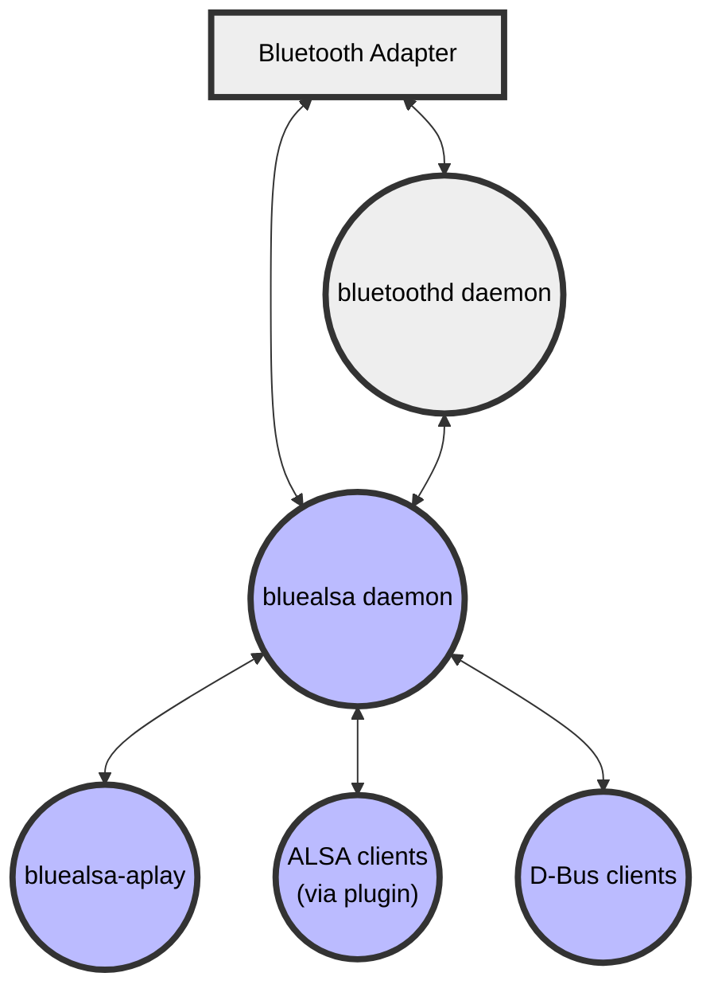

# Bluetooth Audio ALSA Backend

[](https://github.com/Arkq/bluez-alsa/actions/workflows/build-and-test.yaml)
[](https://codecov.io/gh/Arkq/bluez-alsa)

## About BlueALSA

This project is a rebirth of a direct integration between [BlueZ](http://www.bluez.org/) and
[ALSA](https://www.alsa-project.org/). Since BlueZ >= 5, the built-in integration has been removed
in favor of 3rd party audio applications. From now on, BlueZ acts as a middleware between an
audio application, which implements Bluetooth audio profile, and a Bluetooth audio device.

The current status quo is, that in order to stream audio from/to a Bluetooth device, one has to
install a general-purpose audio server such as [PulseAudio](https://www.freedesktop.org/wiki/Software/PulseAudio) or [Pipewire](https://pipewire.org/), or use BlueZ version 4 which is deprecated and unmaintained.

This project created and maintains a product called BlueALSA, with which one can achieve the same Bluetooth audio profile support as with PulseAudio, but with fewer dependencies and at a lower level in the software stack.
BlueALSA registers all known Bluetooth audio profiles in BlueZ, so in theory every Bluetooth device (with audio capabilities) can be connected.

BlueALSA is designed specifically for use on small, low-powered, dedicated audio or audio/visual systems where the high-level audio management features of PulseAudio or Pipewire are not required. The target system must be able to function correctly with all its audio applications interfacing directly with ALSA. In such systems BlueALSA adds Bluetooth audio support to the existing ALSA sound card support.

BlueALSA consists of the daemon `bluealsa`, ALSA plugins, and a number of utilities. The basic context is shown in this diagram:

The heart of BlueALSA is the daemon `bluealsa` which interfaces with the Bluez Bluetooth daemon `bluetoothd` and the local Bluetooth adapter. It handles the profile connection and configuration logic for A2DP, HFP and HSP and presents the resulting audio streams to applications via D-Bus.

BlueALSA includes ALSA plugins which hide all the D-Bus specifics and permit applications to use the ALSA PCM and mixer interfaces, so that existing ALSA applications can access Bluetooth audio devices in the same way as they use sound card PCMs and mixers.

BlueALSA also includes a number of utility applications. Of particular note are:

* bluealsa-aplay\
   an application to simplify the task of building a Bluetooth speaker using BlueALSA.

* bluealsa-cli\
   an application to allow command-line management of the BlueALSA system.

* bluealsa-rfcomm\
   a command-line application which provides access to the RFCOMM terminal for HFP/HSP devices

## Installation

BlueALSA uses the GNU autoconf/automake build system. Build and install instructions are included in the file [INSTALL.md](./INSTALL.md) and more detailed guidance is available in the [wiki](https://github.com/Arkq/bluez-alsa/wiki/Installation-from-source)

## Usage

### bluealsa daemon

The main component of BlueALSA is a program called `bluealsa`. By default, this program shall be
run as a root during system startup. It will register `org.bluealsa` service in the D-Bus system
bus, which can be used for accessing configured audio devices. In general, BlueALSA acts as a
proxy between BlueZ and ALSA.

For details of command-line options to `bluealsa`, consult the [bluealsa manual page](./doc/bluealsa.8.rst).

### ALSA plugins

In order to stream audio to the e.g. Bluetooth headset, firstly one has to connect the device. The
most straightforward method is to use BlueZ CLI utility called `bluetoothctl`. When the device is
connected one can use the `bluealsa` virtual PCM device with ALSA applications just like any other PCM device:

```sh
aplay -D bluealsa Bourree_in_E_minor.wav
```

If there is more than one bluetooth device connected, the target one can be specified as a parameter to the PCM:
```sh
aplay -D bluealsa:XX:XX:XX:XX:XX:XX, Bourree_in_E_minor.wav
```

Please note that this PCM device is based on the [ALSA software PCM I/O
plugin](https://www.alsa-project.org/alsa-doc/alsa-lib/pcm_external_plugins.html) - it will not be
available in the [ALSA Kernel proc
interface](https://www.kernel.org/doc/html/latest/sound/designs/procfile.html).

Setup parameters of the bluealsa PCM device can be set in the local `.asoundrc` configuration file
like this:

```sh
cat ~/.asoundrc
defaults.bluealsa.service "org.bluealsa"
defaults.bluealsa.device "XX:XX:XX:XX:XX:XX"
defaults.bluealsa.profile "a2dp"
defaults.bluealsa.delay 10000
```

BlueALSA also allows to capture audio from the connected Bluetooth device. To do so, one has to
use the capture PCM device.  e.g.:

```sh
arecord -D bluealsa -f s16_le -c 2 -r 48000 capture.wav
```

In addition to A2DP profile, used for high quality audio, BlueALSA also allows to use phone audio
connection via SCO link. One can use either build-in HSP/HFP support, which implements only audio
related part of the specification, or use [oFono](https://01.org/ofono) service as a back-end. In
order to open SCO audio connection one shall switch to `sco` profile like follows:

```sh
aplay -D bluealsa:DEV=XX:XX:XX:XX:XX:XX,PROFILE=sco Bourree_in_E_minor.wav
```

In order to control input or output audio level, one can use provided `bluealsa` control plugin.
This plugin allows adjusting the volume of the audio stream or simply mute/unmute it, e.g.:

```sh
amixer -D bluealsa sset '<control name>' 70%
```

where the control name is the name of a connected Bluetooth device with a control element suffix,
e.g.:

```sh
amixer -D bluealsa sset 'Jabra MOVE v2.3.0 - A2DP' 50%
```

For full details of the BlueALSA ALSA PCM device and mixer device consult the [BlueALSA plugins manual
page](./doc/bluealsa-plugins.7.rst).

There are also a number of articles on the [bluez-alsa project wiki](https://github.com/Arkq/bluez-alsa/wiki) giving more examples of using these plugins.

For more advanced ALSA configuration, consult the [asoundrc on-line
documentation](https://www.alsa-project.org/main/index.php/Asoundrc) provided by the AlsaProject
wiki page.

### bluealsa-aplay

It is possible to create Bluetooth-powered speaker using BlueALSA. For this it is required to forward
the audio signal from the BlueALSA capture PCM to some other playback PCM (e.g. built-in audio card).
In order to simplify this task, BlueALSA includes a program called `bluealsa-aplay`, which acts as a simple BlueALSA player. Connect your Bluetooth device (e.g. smartphone) and do as follows:

```sh
bluealsa-aplay XX:XX:XX:XX:XX:XX
```

For details of command-line options to `bluealsa-aplay`, consult the [bluealsa-aplay manual
page](./doc/bluealsa-aplay.1.rst). There are also some articles on the [bluez-alsa wiki](https://github.com/Arkq/bluez-alsa/wiki) giving examples of its use.

The list of available BlueALSA PCMs (provided by connected Bluetooth devices with audio
capabilities) can be obtained directly from [BlueALSA D-Bus API](doc/bluealsa-api.txt) or using
`bluealsa-aplay` as a convenient wrapper as follows:

```sh
bluealsa-aplay -L
```

## Troubleshooting

1. Using BlueALSA alongside PulseAudio or Pipewire.

   Due to BlueZ limitations, only one program can register as provider of Bluetooth audio profile
   implementation. So it is not possible to use BlueALSA if either PulseAudio or Pipewire are also
   running with their own Bluetooth modules enabled; it is first necessary to disable Bluetooth in
   those applications.

2. ALSA thread-safe API (alsa-lib >= 1.1.2, <= 1.1.3).

   ALSA library versions 1.1.2 and 1.1.3 had a bug in their thread-safe API functions. This bug
   does not affect hardware audio devices, but it affects many software plug-ins. Random deadlocks
   are inevitable. The best advice is to use a more recent alsa-lib release, or if that is not
   possible then disable the thread locking code via an environment variable, as follows:
   `export LIBASOUND_THREAD_SAFE=0`.

3. Couldn't acquire D-Bus name: org.bluealsa

   It is not possible to run more than one instance of the BlueALSA server per D-Bus interface. If
   one tries to run second instance, it will fail with the `"Couldn't acquire D-Bus name:
   org.bluealsa"` error message. This message might also appear when D-Bus policy does not allow
   acquiring "org.bluealsa" name for a particular user - by default only root is allowed to start
   BlueALSA server.

4. Couldn't get BlueALSA PCM: PCM not found

   In contrast to standard ALSA sound cards, BlueALSA does not expose all PCMs right away. In the
   first place it is required to connect remote Bluetooth device with desired Bluetooth profile -
   run `bluealsa --help` for the list of available profiles. For querying currently connected audio
   profiles (and connected devices), run `bluealsa-aplay --list-devices`. The common misconception
   is an attempt to use A2DP playback device as a capture one in case where A2DP is not listed in
   the "List of CAPTURE Bluetooth Devices" section.

   Additionally, the cause of the "PCM not found" error might be an incorrect ALSA PCM name. Run
   `bluealsa-aplay --list-pcms` for the list of currently available ALSA PCM names - it might give
   you a hint what is wrong with your `.asoundrc` entry. Also, take a look at the
   [bluealsa-plugins manual page](./doc/bluealsa-plugins.7.rst).

## Contributing

This project welcomes contributions of code, documentation and testing. For code and manual page contributions, please use Github Pull Requests. There is no strict policy for PRs, each contribution will be evaluated individually. If you wish to help by testing PRs or by making review comments please do so by adding comments to the PR.

When preparing a pull request, if possible please configure with `--enable-test`, and to catch as many coding errors as possible please compile with:
```
make CFLAGS="-Wall -Wextra -Werror"
```
and then run the unit test suite:
```
make check
```

The project wiki is "public" and contributions there are also welcome.

## Bug reports, feature requests, and requests for help

Please search previous issues (both open and closed), to see if your question has already been answered or problem resolved, before raising a new issue. If reporting a problem, please clearly state the version of BlueALSA that you are using, and give sufficient information for readers to be able to reproduce the issue.

Please also look at the [wiki](https://github.com/Arkq/bluez-alsa/wiki) if you require help as there is a great deal of useful information there. Unfortunately the wiki is not indexed by web search engines, so searching on-line for your issue will not discover the information in there.

## License

BlueALSA is licensed under the terms of the MIT license. See the [LICENSE file](./LICENSE) for details.

## Resources

1. [Bluetooth Adopted Specifications](https://www.bluetooth.com/specifications/adopted-specifications)
2. [Bluetooth Design Guidelines](https://developer.apple.com/hardwaredrivers/BluetoothDesignGuidelines.pdf)
3. [RTP Payload Format for MPEG-4](https://tools.ietf.org/html/rfc6416)
4. [Coding of MPEG-4 Audio](https://www.iso.org/standard/42739.html)
5. [ALSA project library reference](https://www.alsa-project.org/alsa-doc/alsa-lib/index.html)
