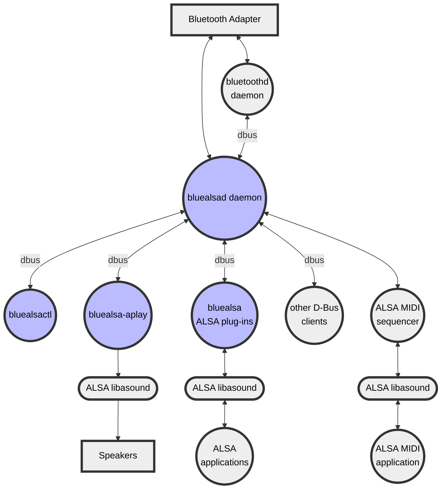

# Bluetooth Audio ALSA Backend

> [!WARNING]
> The latest source uses new names for some core components:
>
> * The `bluealsa` daemon is now called `bluealsad`
> * The `bluealsa-cli` utility is now called `bluealsactl`
>
> See the wiki guide [Migrating from release 4.3.1 or earlier](https://github.com/arkq/bluez-alsa/wiki/Migrating-from-release-4.3.1-or-earlier)
> for more information.

[](https://github.com/arkq/bluez-alsa/actions/workflows/build-and-test.yaml)
[](https://app.codecov.io/gh/arkq/bluez-alsa)

## About BlueALSA

This project is a rebirth of a direct integration between [BlueZ][] and
[ALSA][]. Since BlueZ >= 5, the built-in integration has been removed in favor
of 3rd party audio applications. From now on, BlueZ acts as a middleware
between an audio application, which implements Bluetooth audio profile, and a
Bluetooth audio device.

The current status quo is, that in order to stream audio from/to a Bluetooth
device, one has to install a general-purpose audio server such as [PipeWire][]
or [PulseAudio][], or use BlueZ version 4 which is deprecated and unmaintained.

[BlueZ]: http://www.bluez.org/
[ALSA]: https://www.alsa-project.org/
[PipeWire]: https://pipewire.org/
[PulseAudio]: https://www.freedesktop.org/wiki/Software/PulseAudio

This project created and maintains a product called BlueALSA, with which one
can achieve the same Bluetooth audio profile support as with PulseAudio, but
with fewer dependencies and at a lower level in the software stack. BlueALSA
registers all the classic Bluetooth audio profiles in BlueZ, and also the
BLE-MIDI profile, but the other BLE audio profiles are not (yet) supported.
So in theory every Bluetooth device (with classic audio capabilities)
can be connected.

BlueALSA is designed specifically for use on small, low-powered, dedicated
audio or audio/visual systems where the high-level audio management features of
PulseAudio or PipeWire are not required. The target system must be able to
function correctly with all its audio applications interfacing directly with
ALSA, with only one application at a time using each Bluetooth audio stream.
In such systems BlueALSA adds Bluetooth audio support to the existing
ALSA sound card support. Note this means that the applications are constrained
by the capabilities of the ALSA API, and the higher-level audio processing
features of audio servers such as PulseAudio and PipeWire are not available.

BlueALSA consists of the daemon `bluealsad`, ALSA plug-ins, and a number of
utilities. The basic context is shown in this diagram:



The heart of BlueALSA is the daemon `bluealsad` which interfaces with the BlueZ
Bluetooth daemon `bluetoothd` and the local Bluetooth adapter. It handles the
profile connection and configuration logic for A2DP, HFP and HSP and presents
the resulting audio streams to applications via D-Bus.

BlueALSA includes ALSA plug-ins which hide all the D-Bus specifics and permit
applications to use the ALSA PCM and mixer interfaces, so that existing ALSA
applications can access Bluetooth audio devices in the same way as they use
sound card PCMs and mixers.

In case of BLE MIDI, the daemon creates a simple MIDI port directly in ALSA
MIDI sequencer, so that ALSA MIDI application can connect to the remote BLE
MIDI device in the same way as it would connect to a local MIDI device.

BlueALSA also includes a number of utility applications. Of particular note
are:

* bluealsactl\
   an application to allow command-line management of the BlueALSA system.

* bluealsa-aplay\
   an application to simplify the task of building a Bluetooth speaker using
   BlueALSA.

* bluealsa-rfcomm\
   a command-line application which provides access to the RFCOMM terminal for
   HFP/HSP devices.

## Installation

Build and install instructions are included in the file
[INSTALL.md](INSTALL.md) and more detailed guidance is available in the
[wiki](https://github.com/arkq/bluez-alsa/wiki/Installation-from-source).

## Usage

### bluealsad daemon

The main component of BlueALSA is a program called `bluealsad`. By default,
this program shall be run as a root during system startup. It will register
`org.bluealsa` service in the D-Bus system bus, which can be used for accessing
configured audio devices. In general, BlueALSA acts as a proxy between BlueZ
and ALSA.

The `bluealsad` daemon must be running in order to pair, connect, and use
remote Bluetooth audio devices. In order to stream audio to e.g. a Bluetooth
headset, firstly one has to connect the device. If you are not familiar with
the Bluetooth pairing and connecting procedures on Linux, there is a basic
guide in the wiki:
[Bluetooth pairing and connecting](https://github.com/arkq/bluez-alsa/wiki/Bluetooth-Pairing-And-Connecting).

For details of command-line options to `bluealsad`, consult the [bluealsad
manual page](doc/bluealsad.8.rst).

### ALSA plug-ins

When a Bluetooth audio device is connected one can use the `bluealsa`
virtual PCM device with ALSA applications just like any other PCM device:

```sh
aplay -D bluealsa Bourree_in_E_minor.wav
```

If there is more than one Bluetooth device connected, the target one can be
specified as a parameter to the PCM:

```sh
aplay -D bluealsa:XX:XX:XX:XX:XX:XX, Bourree_in_E_minor.wav
```

Please note that this PCM device is based on the [ALSA software PCM I/O
plug-in][] - it has no associated sound card, and it will not be available in
the [ALSA Kernel proc interface][].

[ALSA software PCM I/O plug-in]: https://www.alsa-project.org/alsa-doc/alsa-lib/pcm_external_plugins.html
[ALSA Kernel proc interface]: https://www.kernel.org/doc/html/latest/sound/designs/procfile.html

Setup parameters of the `bluealsa` PCM device can be set in the local
`.asoundrc` configuration file like this:

```sh
cat ~/.asoundrc
defaults.bluealsa.service "org.bluealsa"
defaults.bluealsa.device "XX:XX:XX:XX:XX:XX"
defaults.bluealsa.profile "a2dp"
defaults.bluealsa.delay 10000
```

BlueALSA also allows to capture audio from the connected Bluetooth device. To
do so, one has to use the capture PCM device, e.g.:

```sh
arecord -D bluealsa -f s16_le -c 2 -r 48000 capture.wav
```

In addition to A2DP profile, used for high quality audio, BlueALSA also allows
to use phone audio connection via SCO link. One can use either built-in HSP/HFP
support, which implements only audio related part of the specification, or use
[oFono][] service as a back-end. In order to open SCO audio connection one
shall switch to `sco` profile like follows:

[oFono]: https://01.org/ofono

```sh
aplay -D bluealsa:DEV=XX:XX:XX:XX:XX:XX,PROFILE=sco Bourree_in_E_minor.wav
```

In order to control input or output audio level, one can use provided
`bluealsa` control plug-in. This plug-in allows adjusting the volume of the
audio stream or simply mute/unmute it, e.g.:

```sh
amixer -D bluealsa sset '<control name>' 70%
```

where the control name is the name of a connected Bluetooth device with a
control element suffix, e.g.:

```sh
amixer -D bluealsa sset 'Jabra MOVE v2.3.0 A2DP' 50%
```

For full details of the BlueALSA ALSA PCM device and mixer device consult the
[BlueALSA plug-ins manual page](doc/bluealsa-plugins.7.rst).

There are also a number of articles on the [bluez-alsa project wiki][] giving
more examples of using these plug-ins.

[bluez-alsa project wiki]: https://github.com/arkq/bluez-alsa/wiki

For more advanced ALSA configuration, consult the [asoundrc on-line
documentation][] provided by the AlsaProject wiki page.

[asoundrc on-line documentation]: https://www.alsa-project.org/main/index.php/Asoundrc

### bluealsa-aplay

It is possible to create Bluetooth-powered speaker using BlueALSA. For this it
is required to forward the audio signal from the BlueALSA capture PCM to some
other playback PCM (e.g. built-in audio card).  In order to simplify this task,
BlueALSA includes a program called `bluealsa-aplay`, which acts as a simple
BlueALSA player. Connect your Bluetooth device (e.g. smartphone) and do as
follows:

```sh
bluealsa-aplay XX:XX:XX:XX:XX:XX
```

For details of command-line options to `bluealsa-aplay`, consult the
[bluealsa-aplay manual page](doc/bluealsa-aplay.1.rst). There are also some
articles on the [bluez-alsa project wiki][] giving examples of its use.

The list of available BlueALSA PCMs (provided by connected Bluetooth devices
with audio capabilities) can be obtained directly from [BlueALSA D-Bus
API](doc/org.bluealsa.PCM1.7.rst) or using `bluealsa-aplay` as a convenient
wrapper as follows:

```sh
bluealsa-aplay -L
```

## Release Policy

The bluez-alsa project does not create nor distribute release software
packages. However, at irregular intervals, when an important new feature or fix
is considered stable then the `master` branch is tagged with a release version
number. These tags are included only to mark reference baselines; their main
purpose is to help Linux distribution package maintainers to relate their own
package versioning schemes to the original codebase.

A release tag is formed as `vN.N.N` where the first number indicates a change
that is **not** backwards compatible (often a change to the D-Bus API), the
second a feature addition that **is** backwards compatible, and the third a
backwards compatible bug-fix or internal change. This scheme complies with the
rules of [Semantic Versioning]. The most significant changes included in each
tag are listed in the [NEWS] file. For more detail on the changes please
consult the [commit history].

All changes are applied only to the `master` branch. There are no release
branches and no support for old release tags. Distributions are expected to
maintain their own patches if they need to support a package based on a release
tag without upgrading to the latest `master` branch source.

## Contributing

This project welcomes contributions of code, documentation and testing.

Please see the [CONTRIBUTING] guide for details.

## Bug reports, feature requests, and requests for help

The most commonly encountered errors are discussed in the
[TROUBLESHOOTING] guide. Please check that file to see if there is already a
solution for your issue.

If you are unable to find a solution in that document or by reading the
[manual pages][], then please search [previous issues][] (both open and
closed), and consult the [wiki][] before raising a new issue. Unfortunately
the wiki is not indexed by web search engines, so searching on-line for your
issue will not discover the information in there.

If reporting a problem as a new issue, please use the appropriate
[bluez-alsa GitHub issue reporting template][] and complete each section of
the template as fully as possible. Note that the `Bug report` template should
be used for all questions relating to a specific installation of BlueALSA, even
if you are not sure that it is a bug. In this way readers will
be given specific information about the context of the problem which will make
it easier to find a solution.

[NEWS]: NEWS
[CONTRIBUTING]: CONTRIBUTING.md
[TROUBLESHOOTING]: TROUBLESHOOTING.md
[manual pages]: doc/
[commit history]: https://github.com/arkq/bluez-alsa/commits/master/
[previous issues]: https://github.com/arkq/bluez-alsa/issues
[wiki]: https://github.com/arkq/bluez-alsa/wiki
[bluez-alsa GitHub issue reporting template]: https://github.com/arkq/bluez-alsa/issues/new/choose
[Semantic Versioning]: https://semver.org/

## License

BlueALSA is licensed under the terms of the MIT license. See the [LICENSE
file](LICENSE) for details.

## Resources

1. [Bluetooth Adopted Specifications](https://www.bluetooth.com/specifications/adopted-specifications)
1. [Bluetooth LE MIDI Specification](https://www.midi.org/specifications-old/item/bluetooth-le-midi)
1. [Bluetooth Design Guidelines](https://developer.apple.com/hardwaredrivers/BluetoothDesignGuidelines.pdf)
1. [RTP Payload Format for MPEG-4](https://tools.ietf.org/html/rfc6416)
1. [Coding of MPEG-4 Audio](https://www.iso.org/standard/42739.html)
1. [ALSA project library reference](https://www.alsa-project.org/alsa-doc/alsa-lib/index.html)
